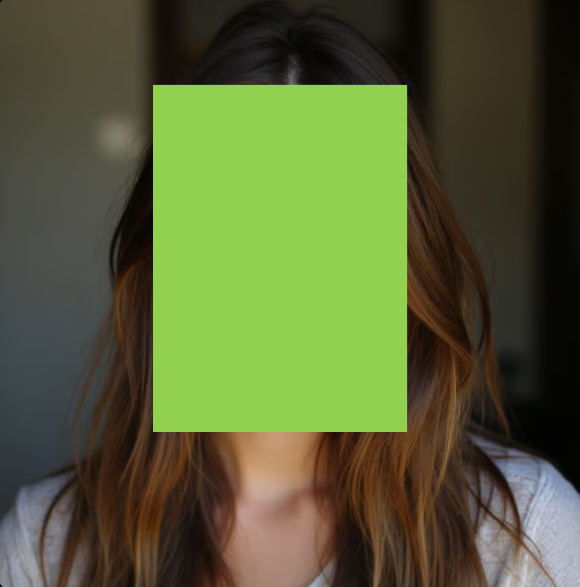

# Dataset

We anonymized the dataset. Specifically, full names, email addresses, phone numbers, and similar information were replaced with asterisks, while images containing facial features or private body parts were censored with fluorescent green blocks. Note that, since most first names or last names alone are usually insufficient to identify a specific individual, we only classify content as potentially harmful when a full name is detected. However, to better protect user privacy when publishing the dataset, we anonymized all content that could potentially be names. 
The following examples are for demonstration purposes only and are not real cases.

Examples:

John Doe, Example@gmail.com &rarr; J*** D**, *******@gmail.com

<!-- → -->

picture generated by [lucipic AI](https://lucidpic.com/)

